# Embedded Controller Final Project : Real Safety Helmet

## LAB: EC Design Problem

**Date:** 2024-12-13

**Author/Partner:** JEON HyeonGyu (22000660) / HWANG MooYeol (22000814)

**Github:** [repository link](https://github.com/HWANGMooYeol/EC-HWANGMooYeol-814)

**Demo Video:** [Youtube link](https://youtu.be/d4H0N-ZpbkU)

## I. Introduction

### Overview

In this project, we developed a **smart safety helmet** equipped with advanced functionalities to enhance safety and situational awareness for users. Utilizing a  STM32 as the core, the helmet incorporates multiple sensors and systems to provide real-time data and responsive features. The main functionalities of the helmet include:

- **Temperature Detection**: Monitors the user's body temperature to identify potential health issues or environmental risks.
- **Rear Detection**: Detects objects or movements behind the user, ensuring enhanced situational awareness in blind spots.
- **Impact Detection**: Senses significant impacts on the helmet to alert emergency services or trigger safety protocols.
- **Brightness Detection**: Adjusts integrated lighting systems enhancing visibility in low-light environments.
- **Harmful Gas Detection**: Identifies the presence of dangerous gases to warn the user and prevent exposure to hazardous conditions.

Additionally, the project includes a **monitoring pad** that provides supervisors with real-time updates and safety data. The pad is designed to:

- **Track Safety Records**: Displays the number of accident-free days, fostering awareness of safety performance.
- **Impact Alerts**: When an impact is detected on the helmet, the pad triggers an audible siren and displays a message to alert the supervisor.
- **Automatic Reset of Safety Records**: If an impact is detected, the system resets the accident-free day counter to zero, ensuring accurate tracking of safety incidents.

The smart safety helmet, combined with a centralized monitoring system, represents an innovative solution that enhances both individual safety and team oversight across various applications, including industrial worksites, construction zones, and hazardous environments, demonstrating the effective integration of MCU technology with advanced sensors and supervisory tools to address real-world safety challenges.

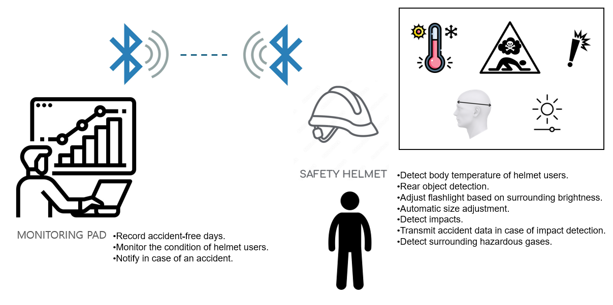

​																						Fig 1. Project overview


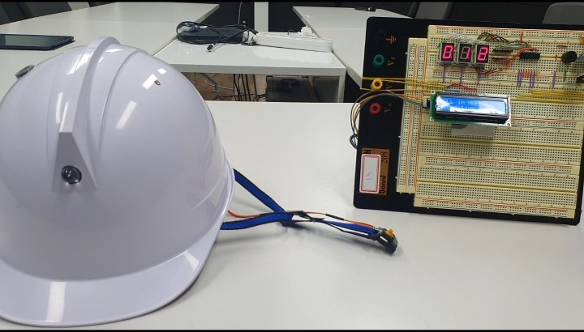

​																						Fig 2. Project overview demo


### Requirements

#### Hardware

- **Helmet part**

| **Item**       | **Model/Description**                  | **Qty** |
| -------------- | -------------------------------------- | ------- |
| MCU            | NUCLEO -F411RE                         | 1       |
| Analog Sensor  | HS-CDSM / Photoresistor Light sensor   | 1       |
|                | MQ-7 / Gas sensor (CO-Carbon Monoxide) | 1       |
|                | TMP36 / Temperature sensor             | 1       |
|                | FSR402 / Pressure sensor               | 2       |
| Digital Sensor | HC-SR04 / Ultrasonic distance sensor   | 1       |
|                | SW-420 / Shock sensor                  | 1       |
| Actuator       | ULN2003 / Stepper Motor Driver         | 1       |
|                | 28BYJ-48 / Stepper Motor               | 1       |
|                | Mini Vibration Motor                   | 1       |
| Communication  | HC-06 (Master) / Bluetooth Module      | 1       |
| Others         | LED(Red)                               | 1       |
|                | LED(Yellow)                            | 1       |
|                | LED(Blue)                              | 1       |
|                | RGB LED                                | 1       |
|                | mini-breadboard                        | 1       |
|                | Resistor (220 ohm)                     | 1       |
|                | Resistor (10K ohm)                     | 3       |
|                | 9V battery                             | 1       |
|                | safety helmet                          | 1       |


- **Monitoring part**

| **Item**      | **Model/Description**            | **Qty** |
| ------------- | -------------------------------- | ------- |
| MCU           | NUCLEO -F411RE                   | 1       |
|               | ARDUINO UNO                      | 1       |
| Communication | HC-06 (Slave) / Bluetooth Module | 1       |
| Others        | 5101ASR / 7-segment display      | 3       |
|               | Array resistor (330 ohm)         | 2       |
|               | 74LS47 / Decoder chip            | 1       |
|               | breadboard                       | 1       |
|               | HC12G-P / Buzzer                 | 1       |
|               | SZH-EK101 / I2C LCD module       | 1       |


#### Software

- **Keil uVision IDE**
- **CMSIS**
- **EC_HAL**
- **Arduino IDE**
- **CATIA**

------

## II. Problem

### Problem Description

- **Helmet part**

MODE

| **Mode**                     | **Description**                                              |
| ---------------------------- | ------------------------------------------------------------ |
| **Sensing surrounding mode** | It includes **rear detection** for identifying objects or movements in blind spots, **brightness monitoring** to adapt to changing light conditions, **harmful gas detection** to prevent exposure to dangerous environments, **impact detection** to sense shocks and **temperature monitoring** to track body heat for potential health risks. These combined features ensure comprehensive awareness and protection in dynamic environments by sensors. |
| **Auto sizing mode**         | Ensures a secure and comfortable fit by automatically adjusting the helmet based on the user's head size and shape. Using sensors and an MCU, detects when the helmet is worn and recognizes the head size to **adjust the fit** accordingly. Pressing the button attached to the chinstrap **releases the helmet**. |


FUNCTION

| **Function**                   | **Sensor**                                  | **Configuration**                                            | **Comments**                                                 |
| ------------------------------ | ------------------------------------------- | ------------------------------------------------------------ | ------------------------------------------------------------ |
| **Helmet Auto sizing**         | Pressure sensor (x2), stepper motor, button | The values from the pressure sensor are stored in **JADC_CH4** and the **ADC** register by **PC_3** and **PC_4** pins. The button is connected to pin **PC_13**, extended to use **EXTI15_10** for external interrupt handling. | Need to verify the correct direction for the stepper motor and implement the physical circuit for the button’s push-down functionality. To avoid making the function for operating the stepper motor too long, provide around 100 steps at a time. |
| **Body temperature detection** | temperature sensor, LED(red), LED(Blue)     | Temperature values stored in  **JADC_CH3** register by pin **PC_2**. LED(red) uses **PC_14**. LED(blue) uses **PC_15**. | Using raw ADC values can result in slow detection of temperature changes. It is recommended to multiply the ADC values by an appropriate calibration constant to improve the speed and accuracy of temperature detection. |
| **Rear detection**             | Ultrasonic distance sensor, LED(yellow)     | The ultrasonic sensor uses **input timer capture** to measure the distance by echo pin **PB_6** and trig pin **PA_6**. If the distance is within 15 cm, it sends a high signal to the **PB_2** pin, turning on the yellow LED. | Due to the characteristics of the HC-SR04 ultrasonic sensor, it is difficult to measure distances within 3 cm. When using the ultrasonic sensor to measure distance, there can be cases where the distance values fluctuate. These fluctuations are handled by implementing a filtering or smoothing algorithm to ensure more stable and reliable distance measurements. |
| **Toxic gas detection**        | Gas sensor, vibration motor                 | The value read from the gas sensor is stored in **JADC_CH2** by pin **PC_1**. This stored value is then used to activate the vibration motor connected to **PC_10**. | The gas sensor used in this lab is a carbon monoxide (CO) sensor, but when using other gas sensors, the threshold value should be adjusted accordingly. Additionally, when using multiple gas sensors, a function can be created to differentiate between gases by using vibration patterns. This function would map specific vibration patterns to corresponding gases, providing a clear indication of which gas is detected based on the sensor readings. |
| **LED adaptive brightness**    | Photoresistor, LED                          | The light sensor detects the surrounding ambient light and stores the value in **JADC_CH1** through **PC_0**. Based on the stored value, a PWM signal is output through **PA_1** to adjust the brightness of the LED. | When using an LED, even with a duty cycle of 0, there may still be a faint light emitted. To compensate for this, a hardware or software solution can be implemented, such as adding a low-pass filter to smooth the PWM signal or introducing a minimum duty cycle threshold to ensure the LED remains completely off when intended. |
| **Shock detection**            | Shock sensor, Bluetooth module(Master)      | The **PB_3** pin, connected to the shock sensor, triggers an external interrupt **EXTI3**. When **EXTI3** is triggered, it sends the value '1' via **PA_9 (USART1_TX)**. PA_10 is for USART1_RX. | To establish a 1-to-1 communication between two HC-06 Bluetooth modules, one module needs to be set as the **MASTER** and the other as the **SLAVE**. The MASTER module initiates the connection, while the SLAVE module waits for the connection request from the MASTER. That's why the helmet, which provides shock information, should be set as the MASTER. |


- **Monitoring part**

MODE

| **Mode**        | **Description**                                              |
| --------------- | ------------------------------------------------------------ |
| **Normal mode** | **Records the number of accident-free days** and receives information from the helmet. It also **displays a message** stating "All in normal condition" to indicate that the system is functioning properly. This mode ensures that users can easily monitor the helmet's status and track safety performance with real-time updates. |
| **Shock mode**  | Activated when a shock or impact is detected by the helmet's sensors. In this mode, the **system triggers an alert** by **sending a notification, generating a sound**, to inform the user or supervisor of the impact. The mode also **resets the accident-free days count to zero**, ensuring that safety records are updated immediately. This mode is critical for maintaining awareness of potential safety hazards in environments where impacts may occur. |


FUNCTION

| **Function**            | **Sensor**                          | **Configuration**                                            | **Comments**                                                 |
| ----------------------- | ----------------------------------- | ------------------------------------------------------------ | ------------------------------------------------------------ |
| **Up count date**       | 7-segment                           | Set up **Timer2 interrupt of 86,400sec** (1day). Increment a cnt on each interrupt. The **cnt** value is then displayed on a 7-segment display to show the elapsed day. | To implement a 3-digit 7-segment display using a single decoder, you can use a **multiplexing technique**. This method involves rapidly switching between the three digits so that each digit is displayed sequentially, but the human eye perceives all three digits as being displayed simultaneously due to the fast switching. |
| **Ring Siren**          | Buzzer                              | The **PC_6** pin is used for triggering the buzzer. The **siren()** function is called to activate the buzzer. | By adjusting the **durations**, **period**, and **pulse width** of the PWM signal, it is possible to generate the desired tone for the buzzer. |
| **Send Message**        | LCD                                 | When an input signal is received on the Arduino's **D12** pin, the **A4** and **A5** pins are used for **I2C** communication to display a message on the LCD screen. | Couldn't implement I2C communication on the STM32, utilized the Arduino open-source LCD library. If successfully implement I2C communication on the STM32, the Arduino is not  necessary. |
| **Reset date counting** | USART1 ,bluetooth(Slave), 7-segment | When '1' is received through the TX of the Bluetooth module to **PA_10** (USART1_RX), the **USART1_IRQHandler()** updates **dng** to 1. Once dng is updated to 1, **cnt** is reset to 0, and the number displayed on the 7-segment display is also reset to 0. | The reason for setting the threshold value **dng** to reset **cnt** to 0 is to prevent the **USART1_IRQHandler()** interrupt from being triggered multiple times, which would continuously reset **cnt** to 0. |


### MCU Configuration

**Helmet MCU**

| **Functions**               | **Register** | **PORT_PIN**           | **Configuration**                                            |
| --------------------------- | ------------ | ---------------------- | ------------------------------------------------------------ |
| System Clock                | RCC          |                        | PLL 84MHz                                                    |
| delay_ms                    | SysTick      |                        |                                                              |
| Timer Interrupt             | TIM2         |                        | 10msec                                                       |
| TIMER                       | TIMER2       |                        | 10msec                                                       |
|                             | TIMER3       |                        | 1msec                                                        |
| Bluetooth                   | USART1       | TXD: PA9 RXD: PA10     | No Parity, 8-bit Data, 1-bit Stop bit 9600 baud-rate         |
| ADC , JADC sampling trigger | TIM3         |                        | ADC and JADC Clock Prescaler /8 12-bit resolution, right alignment Continuous Conversion mode Scan mode: Two channels in regular group External Trigger (Timer3 Trigger) @ 1kHz Trigger Detection on Rising Edge |
| ADC                         | ADC1_CH14    | PC4                    | Analog Mode No Pull-up Pull-down                             |
| JADC                        | ADC1_CH10    | PC0                    | Analog Mode No Pull-up Pull-down                             |
|                             | ADC1_CH11    | PC1                    | Analog Mode No Pull-up Pull-down                             |
|                             | ADC1_CH12    | PC2                    | Analog Mode No Pull-up Pull-down                             |
|                             | ADC1_CH13    | PC3                    | Analog Mode No Pull-up Pull-down                             |
| Ultra Sonic PWM             | TIM3_CH1     | TRIG : PA6             | AF, Push-Pull, No Pull-up Pull-down, Fast, period: 1ms, pulse width: 10us |
|                             | TIM4_CH1     | ECHO : PB6             | AF, Push-Pull, No Pull-up                                    |
| LED(Y)                      | GPIO         | PB2                    | Digital Out, Push-Pull, Pull up, Fast                        |
| LED(R)                      | GPIO         | PA14                   | Digital Out, Push-Pull, Pull up, Fast                        |
| LED(B)                      | GPIO         | PA15                   | Digital Out, Push-Pull, Pull up, Fast                        |
| headlight LED               | GPIO         | PA1                    | AF, Push-Pull, No Pull-up Pull-down, Fast, PWM period: 50msec pulse width: 10usec |
| Vibration motor             | GPIO         | PC10                   | Digital Out, Push-Pull, Pull up, Fast                        |
| Stepper motor               | GPIO         | PB_10 PB_4  PA_5  PB_9 | Digital Out, No pull-up Pull-down , Push-Pull, Fast, 9 rpm   |
| External Interrupt          | GPIO         | PB3                    | Digital In, Pull-up, Falling edge, priority: 2               |
|                             | GPIO         | PC13                   | Digital In, Pull-up, Falling edge, priority: 1               |
| Bluetooth                   | USART1       | TXD: PA9 RXD: PA10     | No Parity, 8-bit Data, 1-bit Stop bit 9600 baud-rate         |

**Monitor MCU**

| **Functions**           | **Register** | **PORT_PIN**       | **Configuration**                                            |
| ----------------------- | ------------ | ------------------ | ------------------------------------------------------------ |
| System Clock            | RCC          |                    | PLL 84MHz                                                    |
| delay_ms                | SysTick      |                    |                                                              |
| Timer Interrupt         | TIM2         |                    | 86400sec (1day)                                              |
| 7-segment with decoder  | GPIO         | PA7 PB6 PC7 PB2    | Digital Out, Push-Pull, No Pull-up-Pull-down, Medium Speed   |
| 7-Segment Display Power | GPIO         | PB10 PB3 PB5       | Digital Out, Push-Pull, No Pull-up-Pull-down, Medium Speed   |
| Siren ring              | GPIO         | PC6                | AF, Push-Pull, No Pull-up Pull-down, Medium Speed, PWM period: 1000msec pulse width: 0usec |
| Message on LCD          | GPIO         | PC0                | Digital Out, Push-Pull, No Pull-up-Pull-down, Medium Speed   |
| External Interrupt      | GPIO         | PC13               | Digital In, Pull-up, Falling edge, priority: 0               |
| Bluetooth               | USART1       | TXD: PA9 RXD: PA10 | No Parity, 8-bit Data, 1-bit Stop bit 9600 baud-rate         |


### Circuit Diagram


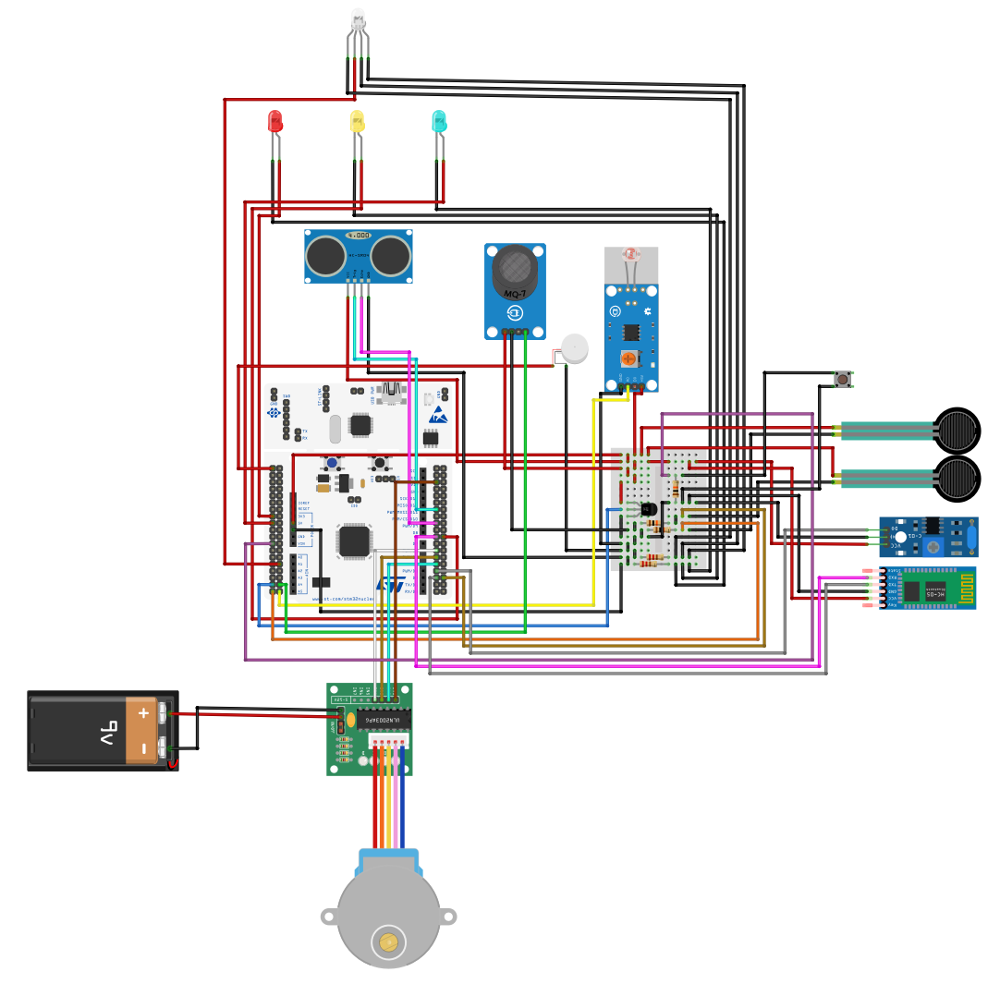

​																				Fig 3. Helmet System circuit diagram 


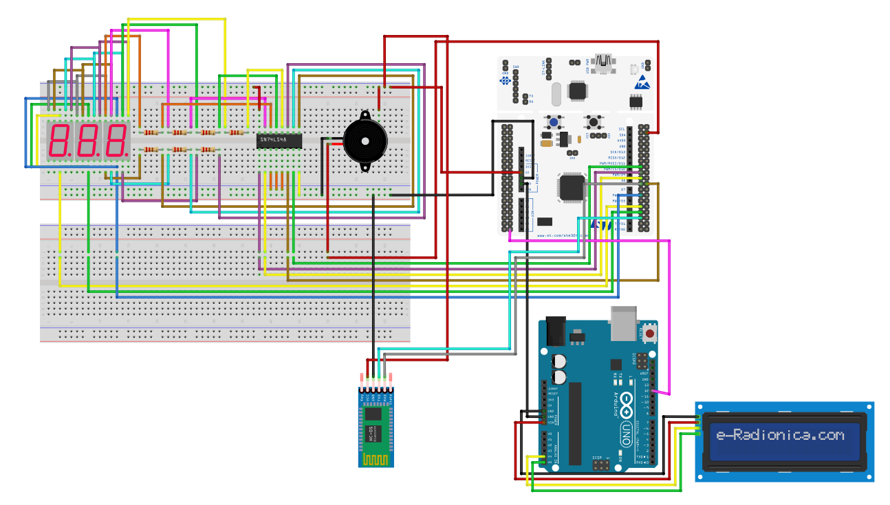

​																				Fig 4. Monitoring System circuit diagram 


## III. Algorithm

### Logic Design

FLAGS

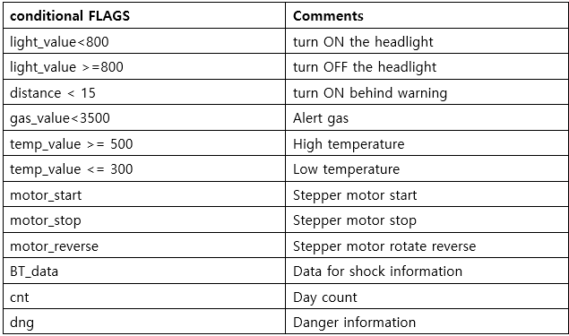


FLOW CHART for HELMET

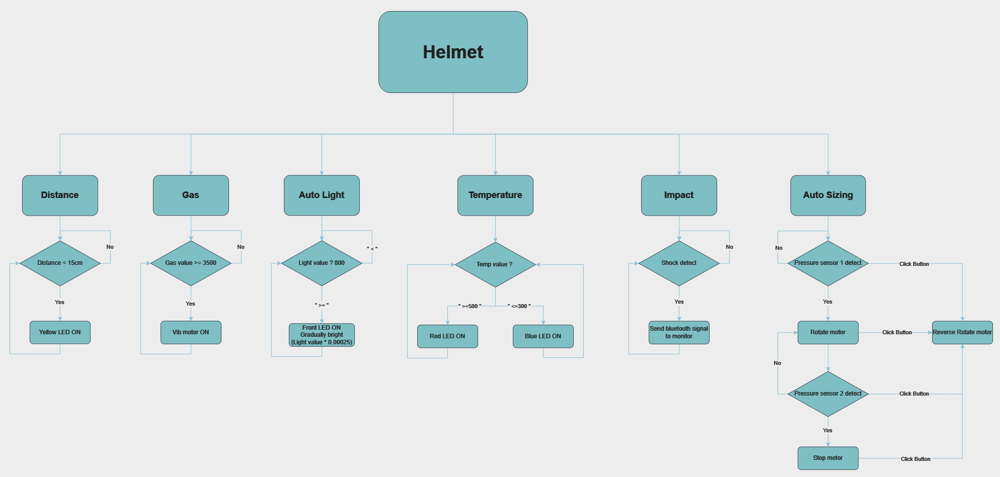


FLOW CHART for Monitoring

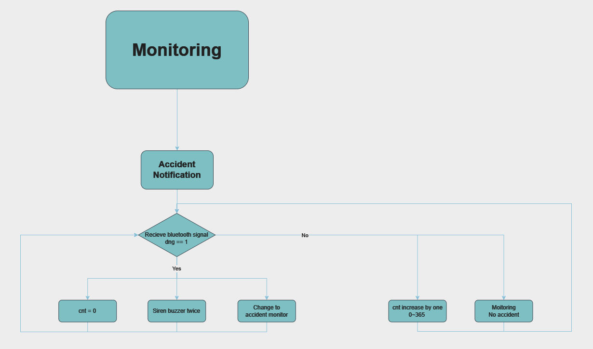


### Code

My code is here: [repository link](https://github.com/HWANGMooYeol/EC-HWANGMooYeol-814)


CODE for HELMET

 `main()` : The function logs light, gas, temperature values, motor control signals, and distance measurements in each cycle. This data can be used for debugging or monitoring the system's status.

 `TIM2_IRQHandler()` : Handles sensor-based operations, such as adjusting headlight brightness, activating warning LEDs for distance and temperature alerts, triggering a vibration motor for gas detection, and controlling the stepper motor for helmet adjustments.

 `TIM4_IRQHandler()` : The Function manages ultrasonic sensor timing by capturing rising and falling edges to calculate the time interval for distance measurement. It also handles timer overflow to ensure accurate calculations.

 `ADC_IRQHandler()` : The function processes ADC conversions, handling overflow and end-of-conversion (EOC) events. It reads and updates sensor values such as *light_value*, *gas_value*, *temp_value*, *motor_start*, and *motor_stop* from the ADC and JADC channels.

 `EXTI3_IRQHandler()` : The function handles external interrupts triggered by the shock sensor on pin PB_3. When a shock is detected, it logs a shock alert message, sends a notification via Bluetooth using USART1.

 `EXTI15_10_IRQHandler()` : The function handles external interrupts triggered by the button on pin PC_13, button connected to the chin strap. When pressed, it sets the motor_reverse flag to initiate the helmet removal process, logs a "HELMET OFF" message.

```c
/**
******************************************************************************
* @author  HWANG MooYeol / JEON HyeonGyu
* @Mod	   2024-11-26
* @brief   PROJECT_REAL_SAFETY_HELMET
******************************************************************************
*/

#include "stm32f411xe.h"
#include "math.h"
#include "ecSTM32F4v2.h"

// Definition alart Pin
#define headlight_analog_pin PA_1
#define behind_warning_led_pin PB_2
#define vib_motor PC_10
#define temp_red_led PA_14
#define temp_blue_led PA_15

// Definition JADC Pin
#define LIGHT_sensor PC_0
#define GAS_sensor PC_1
#define TEMP_sensor PC_2
#define motor_start_pin PC_3

// Definition ADC Pin
#define motor_stop_pin PC_4

// Definition Ultra sonic Pin
#define TRIG PA_6
#define ECHO PB_6

//Definition auto sizing Pin
#define exti_3 PB_3  //shock sensor
#define BUTTON_PIN PC_13

//Definition Stepper motor  ABA'B'
#define Stepper_A PB_10
#define Stepper_B PB_4
#define Stepper_NA PB_5
#define Stepper_NB PB_9

// USART 1 
// PA_9 = USART1_TX (default)	
// PA_10 = USART1_RX (default)

//ADC parameter
uint32_t light_value, gas_value, temp_value;
PinName_t seqCHn[4] = {LIGHT_sensor, GAS_sensor, TEMP_sensor, motor_start_pin};

//Ultra sonic parameter
uint32_t ovf_cnt = 0;
float time_interval_us = 0;
float distance = 0;
float timeInterval = 0;
float time1 = 0;
float time2 = 0;

//helmet parameter
uint32_t motor_start, motor_stop;
int motor_reverse = 0;

// BLUETOOTH parameter
char BT_string[100];
uint8_t BT_Data;

void setup(void);

int main(void) {
	// Initialization --------------------------------------------------
	setup();
	
	// Infinite Loop ---------------------------------------------------
	while(1){
		
		distance = (float) timeInterval * 340.0 / 2.0 / 10.0; 	// [mm] -> [cm]

		printf("---------------------------- \r\n");
		printf("\r\n");
		printf("light value = %d \r\n",light_value);
		printf("\r\n");
		printf("gas value = %d \r\n",gas_value);
		printf("\r\n");
		printf("temp value = %d \r\n",temp_value);
		printf("\r\n");
		printf("motor start value = %d \r\n",motor_start);
		printf("\r\n");
		printf("motor stop value = %d \r\n",motor_stop);
		printf("\r\n");
		printf("Distance = %f cm\r\n", distance);
		printf("\r\n");
	
		delay_ms(1000);
		
	}
}


void TIM2_IRQHandler(void){
	if(is_UIF(TIM2)){			// Check UIF(update interrupt flag)
		
		// for dark mode
		if (light_value<800)
			PWM_duty(headlight_analog_pin, 0.0);
		else if (light_value >=800)
			PWM_duty(headlight_analog_pin, light_value*0.00025);
		
		//for behind alert
		if (distance < 15)
			GPIO_write(behind_warning_led_pin, HIGH);
		else
			GPIO_write(behind_warning_led_pin, LOW);
		
		//for gas alert
		if (gas_value<3500)
			GPIO_write(vib_motor, LOW);
		else if (gas_value >=3500)
			GPIO_write(vib_motor, HIGH);
		
		//for temperature alert
		if (temp_value >= 500)
			GPIO_write(temp_red_led, HIGH);
		else if (temp_value <= 300)
			GPIO_write(temp_blue_led, HIGH);
		else {
			GPIO_write(temp_red_led, LOW);
			GPIO_write(temp_blue_led, LOW);
		}
		
		//for helmet_motor
		
		if (motor_start >= 1000 && motor_stop <= 1000){
			Stepper_step(50, 1,FULL);
			motor_start = 0;
		}
		else if (motor_start >= 1000 && motor_stop >= 1000)
			Stepper_step(0, 0,FULL);
		
		
		if (motor_reverse == 1) {
			motor_reverse = 0;
			Stepper_step(1000, 0, FULL);
			Stepper_step(1000, 0, FULL);
			Stepper_step(1000, 0, FULL); 
			delay_ms(5000);                 //time for taking-off the helmet
		}
			
		clear_UIF(TIM2); 		// Clear UI flag by writing 0
	}
}

//Ultra sonic timerhandler
void TIM4_IRQHandler(void){
	if(is_UIF(TIM4)){                     // check Update interrupt
		ovf_cnt ++;										// count
		clear_UIF(TIM4);  							    // clear
	}
	if(is_CCIF(TIM4, 1)){ // TIM4_Ch1 (IC1) Capture Flag. Rising Edge Detect
		time1 = ICAP_capture(TIM4, 1);			// Capture Time_end
		clear_CCIF(TIM4, 1);                // clear
	}								                      
	else if(is_CCIF(TIM4, 2)){        // TIM4_Ch2 (IC2) Capture Flag. Falling Edge Detect
		time2 = ICAP_capture(TIM4, 2);			// Capture Time start
		time_interval_us = ((time2 - time1) + ovf_cnt * (TIM4->ARR + 1)) * 10; //[us]
		timeInterval = time_interval_us / 1000.0;                  //[ms]
		ovf_cnt = 0;                        		// countreset
		clear_CCIF(TIM4,2);							// clear 
	}
}


void ADC_IRQHandler(void){
	if(is_ADC_OVR())
		clear_ADC_OVR();

	if(is_ADC_EOC()) {
		motor_stop = ADC_read();
		clear_ADC_JEOC();
	}
	
	if(is_ADC_JEOC()){		// after finishing sequence
		
		light_value= JADC_read(1);
		gas_value = JADC_read(2);
		temp_value = JADC_read(3);
		motor_start = JADC_read(4);

		clear_ADC_JEOC();
	}
}


//For Shock detectied
//external interrupt for PB_3 pin
void EXTI3_IRQHandler(void) {  
	if (is_pending_EXTI(exti_3)) {
		
		printf("!!SHOCK!!");
		printf("\r\n");
		printf("!!SHOCK!!");
		printf("\r\n");
		
		sprintf(BT_string, "1");  
		USART_write(USART1, (uint8_t*)(BT_string), 100);
		
		clear_pending_EXTI(exti_3); // cleared by writing '1'
	}
}

//motor reverse
//EXTI for PC_ 13
void EXTI15_10_IRQHandler(void) {
	if (is_pending_EXTI(BUTTON_PIN)) {
		
		motor_reverse = 1;
		printf("HELMET OFF");
		printf("\r\n");
		
		clear_pending_EXTI(BUTTON_PIN); 
	}
}

// Setting setup
void setup(void) {
	RCC_PLL_init();				// System Clock Initiallization
  SysTick_init();
	
	TIM_UI_init(TIM2, 10);
	
	UART1_init();
	UART2_init();			// UART2 Init

	// JADC Init for analog sensor
	JADC_init(LIGHT_sensor);
	JADC_init(GAS_sensor);
	JADC_init(TEMP_sensor);
	
	//helmet
	JADC_init(motor_start_pin);
	ADC_init(motor_stop_pin);

	// ADC channel sequence setting
	JADC_sequence(seqCHn, 4);

	// PWM configuration for Ultra Sonic-------------------------------------
	PWM_init(TRIG);					 // PA_6: Ultrasonic trig pulse
	PWM_period_us(TRIG, 1000);    // PWM of 50ms period. Use period_us()
	PWM_pulsewidth_us(TRIG, 10);   // PWM pulse width of 10us
	
	// Input Capture configuration -----------------------------------------
	ICAP_init(ECHO);    	         // PB_6 as input caputre
 	ICAP_counter_us(ECHO, 10);   	 // ICAP counter step time as 10us
	ICAP_setup(ECHO, 1, IC_RISE);  // TIM4_CH1 as IC1 , rising edge detect
	ICAP_setup(ECHO, 2, IC_FALL);  // TIM4_CH2 as IC2 , falling edge detect
	
	// behind warning led
	GPIO_init(behind_warning_led_pin, OUTPUT);    // calls RCC_GPIOA_enable()
	GPIO_pupd(behind_warning_led_pin, PULL_UP);
	GPIO_otype(behind_warning_led_pin, PUSH_PULL);
	GPIO_ospeed(behind_warning_led_pin, FAST_SPEED);        
	
	// PWM configuration for headlight ------------------------------------
	PWM_init(headlight_analog_pin);
	PWM_period(headlight_analog_pin, 1);
	
	// gas warning vibration motor ----------------------------------------
	GPIO_init(vib_motor, OUTPUT);   
	GPIO_pupd(vib_motor, PULL_UP);
	GPIO_otype(vib_motor, PUSH_PULL);
	GPIO_ospeed(vib_motor, FAST_SPEED);
	
	// temp red led --------------------------------------------------------
	GPIO_init(temp_red_led, OUTPUT);   
	GPIO_pupd(temp_red_led, PULL_UP);
	GPIO_otype(temp_red_led, PUSH_PULL);
	GPIO_ospeed(temp_red_led, FAST_SPEED);
	
	// temp blue led --------------------------------------------------------
	GPIO_init(temp_blue_led, OUTPUT);   
	GPIO_pupd(temp_blue_led, PULL_UP);
	GPIO_otype(temp_blue_led, PUSH_PULL);
	GPIO_ospeed(temp_blue_led, FAST_SPEED);
	
	//Stepper motor ---------------------------------------------------------
	Stepper_init(Stepper_A,Stepper_B,Stepper_NA,Stepper_NB); 	// Stepper GPIO pin initialization
	Stepper_setSpeed(9);               	//  set stepper motor speed rpm
  
	// External Interrupt Setting
	GPIO_init(exti_3, INPUT);
	GPIO_pupd(exti_3, PULL_UP);
	EXTI_init(exti_3, FALL ,2);
	
	GPIO_init(BUTTON_PIN, INPUT); 
	GPIO_pupd(BUTTON_PIN, PULL_UP);
	EXTI_init(BUTTON_PIN, FALL,1);          
	
}
```


CODE for MONITOR (STM32)

`main()` : It updates a 7-segment display with the value of *cnt* and checks for danger conditions. If *dng* is set to 1, it triggers an alarm by activating the LCD and siren, then resets *cnt* and clears *dng*.

 `TIM2_IRQHandler()` : When the interrupt occurs, the function increments the *cnt* variable, which represents the number of accident-free days. If *cnt* exceeds 356, it is reset to 0.

 `USART1_IRQHandler()` :  When this interrupt occurs, the function reads the received data and stores it in the *BT_Data* variable. If the received data is '1', it sets the *dng* flag to 1, which can trigger a siren, Messaging warning and resetting accident-free day.

 //`EXTI15_10_IRQHandler()` : It is a function to manually trigger an external  interrupt by button to activate the *dng* flag if the `USART1_IRQHandler()` fails to operate.

 `siren()` : The function generates a warning sound by playing a sequence of tones using PWM on the siren pin. It iterates through predefined frequencies and durations, setting the PWM period and duty cycle to produce each tone. After the sequence, the PWM output is disabled, stopping the sound.

```c
/**
******************************************************************************
* @author  HWANG MooYeol / JEON HyeonGyu
* @Mod	   2024-11-26
* @brief   PROJECT_REAL_SAFETY_HELMET_MONITOR
******************************************************************************
*/

#include "stm32f411xe.h"
#include "math.h"
#include "ecSTM32F4v2.h"

//PIN Definition
#define BUTTON_PIN PC_13
#define DIGIT1 PB_10
#define DIGIT2 PB_3
#define DIGIT3 PB_5
#define LCD_pin PC_0
#define siren_pin PC_6
#define decoder_A PA_7
#define decoder_B PB_6
#define decoder_C PC_7
#define decoder_D PB_2

// BLUETOOTH parameter
char BT_string[100];
uint8_t BT_Data;

// USART 1 
// PA_9 = USART1_TX (default)	
// PA_10 = USART1_RX (default)

// DANGER parameter
int dng = 0;

void siren(void);

// Initialiization 
void setup(void);
void SysTick_Handler(void);
unsigned int cnt = 0;


int main(void) {
	setup();
	while (1) {
		
		int m1;
		int m2;
		int m3;
		
    m1 = (cnt % 1000) / 100; 
		GPIO_write(DIGIT1, LOW);
    GPIO_write(DIGIT2, LOW);
    GPIO_write(DIGIT3, HIGH);
		sevensegment_display(m1);
		delay_ms(1);
		
		m2 = (cnt % 100) / 10; 
		GPIO_write(DIGIT1, LOW);
    GPIO_write(DIGIT2, HIGH);
    GPIO_write(DIGIT3, LOW);
		sevensegment_display(m2);
		delay_ms(1);
		
		m3 = cnt % 10; 
		GPIO_write(DIGIT1, HIGH);
    GPIO_write(DIGIT2, LOW);
    GPIO_write(DIGIT3, LOW);
		sevensegment_display(m3);
		delay_ms(1);
		
		if (dng == 1) {
			GPIO_write(LCD_pin, HIGH);
			siren();
			delay_ms(500);
			siren();
			GPIO_write(LCD_pin, LOW);
			cnt = 0;
			dng = 0;
			
		}
	}
}

void TIM2_IRQHandler(void){
	if(is_UIF(TIM2)){			// Check UIF(update interrupt flag)

		cnt++; 
		if (cnt > 356) cnt = 0;	
		
		clear_UIF(TIM2); 		// Clear UI flag by writing 0
	}
}

//Communication for bluetooth
void USART1_IRQHandler() {
	if (is_USART1_RXNE()) {
		BT_Data =  USART1_read();
		if (BT_Data == '1') {
			
		dng = 1;
			
		}
	}
}

//EXTI for Pin PC_13
/*
void EXTI15_10_IRQHandler(void) {
	if (is_pending_EXTI(BUTTON_PIN)) {
		
		dng = 1;
		
		clear_pending_EXTI(BUTTON_PIN); 
	}
}
*/


void setup(void) {
	RCC_PLL_init();
	SysTick_init();
	TIM_UI_init(TIM2, 1000*5);
	
	UART2_init();
	UART1_init();
	
	sevensegment_display_init(decoder_A, decoder_B, decoder_C, decoder_D);  // Decoder input A,B,C,D
	GPIO_otype(decoder_A, PUSH_PULL);
	GPIO_otype(decoder_B, PUSH_PULL);
	GPIO_otype(decoder_C, PUSH_PULL);
	GPIO_otype(decoder_D, PUSH_PULL);
	
	GPIO_pupd(decoder_A, NO_PUPD);
	GPIO_pupd(decoder_B, NO_PUPD);
	GPIO_pupd(decoder_C, NO_PUPD);
	GPIO_pupd(decoder_D, NO_PUPD);
	
	GPIO_ospeed(decoder_A, MEDIUM_SPEED);
	GPIO_ospeed(decoder_B, MEDIUM_SPEED);
	GPIO_ospeed(decoder_C, MEDIUM_SPEED);
	GPIO_ospeed(decoder_D, MEDIUM_SPEED);
	
	// Priority Highest(0) External Interrupt 
	EXTI_init(BUTTON_PIN, FALL, 0);
	GPIO_init(BUTTON_PIN, INPUT);  // calls RCC_GPIOC_enable()
	GPIO_pupd(BUTTON_PIN, PULL_UP);
	
	GPIO_init(DIGIT1, OUTPUT);
	GPIO_otype(DIGIT1, PUSH_PULL);
	GPIO_pupd(DIGIT1, NO_PUPD);
	GPIO_ospeed(DIGIT1, MEDIUM_SPEED);
	
	GPIO_init(DIGIT2, OUTPUT);
	GPIO_otype(DIGIT2, PUSH_PULL);
	GPIO_pupd(DIGIT2, NO_PUPD);
	GPIO_ospeed(DIGIT2, MEDIUM_SPEED);
	
	GPIO_init(DIGIT3, OUTPUT);
	GPIO_otype(DIGIT3, PUSH_PULL);
	GPIO_pupd(DIGIT3, NO_PUPD);
	GPIO_ospeed(DIGIT3, MEDIUM_SPEED);
	
	GPIO_write(DIGIT1, LOW);
	GPIO_write(DIGIT2, LOW);
	GPIO_write(DIGIT3, LOW);
	
	GPIO_init(LCD_pin, OUTPUT);
	GPIO_otype(LCD_pin, PUSH_PULL);
	GPIO_pupd(LCD_pin, NO_PUPD);
	GPIO_ospeed(LCD_pin, MEDIUM_SPEED);
	GPIO_write(LCD_pin, LOW);
	
// SIREN PWM configuration -------------------------------------------
  RCC->APB1ENR |= RCC_APB1ENR_TIM3EN;

  GPIO_init(siren_pin, AF);  
   
	GPIO_ospeed(siren_pin, MEDIUM_SPEED);
  PWM_init(siren_pin);              
  PWM_period_us(siren_pin, 1000);   
  PWM_pulsewidth_us(siren_pin, 0); 
}

void siren(void) {
    int frequencies[] = {261, 494, 261, 494,261, 494, 261, 494,261, 494, 261, 494,261, 494, 261, 494};
    int durations[] = {100, 150, 100, 150, 100, 150, 100, 150, 100, 150,100, 100, 100, 150, 100, 150};
    int num_notes = sizeof(frequencies) / sizeof(frequencies[0]);

    for (int i = 0; i < num_notes; i++) {
        PWM_period_us(siren_pin, 1000000 / frequencies[i]);
        PWM_pulsewidth_us(siren_pin, (1000000 / frequencies[i]) / 2);
        delay_ms(durations[i]);
    }

    PWM_pulsewidth_us(siren_pin, 0);

}
```


CODE for MONITOR (Arduino UNO)

This code uses an I2C LCD to display worker safety status based on the input from pin 12. If pin 12 reads HIGH, it shows a danger warning; otherwise, it displays a normal condition message.

```c
#include <Wire.h>
#include <LiquidCrystal_I2C.h>

LiquidCrystal_I2C lcd(0x27, 16, 2);

void setup()  
 {
  lcd.init();

  lcd.backlight();
  pinMode(12, INPUT);

 }

void loop()
{
  if (digitalRead(12) == HIGH){
    lcd.setCursor(0, 0);
    lcd.print("!!WORKER      ");
    lcd.setCursor(0, 1);
    lcd.print("  in DANGER!!");
  }
  else {
    lcd.setCursor(0, 0);
    lcd.print("ALL in NORMAL  ");
    lcd.setCursor(0, 1);
    lcd.print("condition    ");
  }
}
```


------

## IV. Results and Demo

Experiment images and results

>------
>
>Measuring values of the helmet
>
>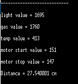
>
>------
>
>**Helmet Auto sizing**
>
>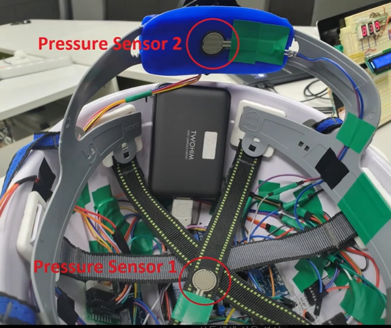
>
>1. motor rotate
>
>
>
>When top Pressure sensors detect the pressure, 'motor start value' changes to '4095' which is used as a thresholding value to rotate the motor clockwise. We can read the value by reading  JADC_CH4 register.
>
>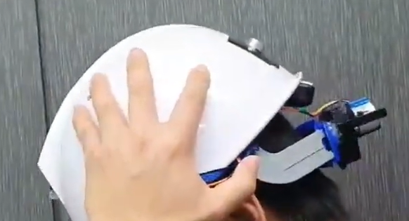
>
>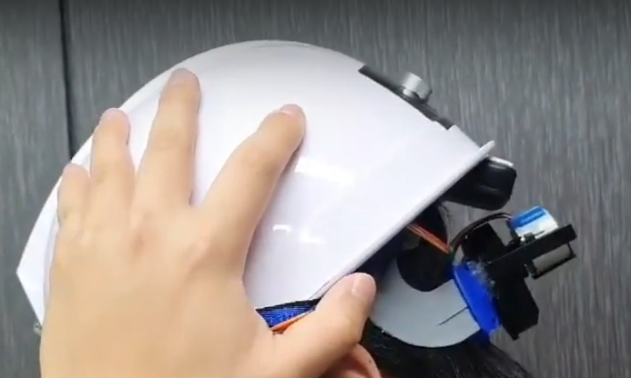
>
>2. motor stop
>
>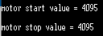
>
>When rear Pressure sensors detect the pressure, 'motor stop value' changes to '4095' which is used as a thresholding value to stop the stepper motor. We can read the value by reading  ADC register.
>
>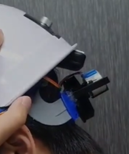
>
>3. motor reverse
>
>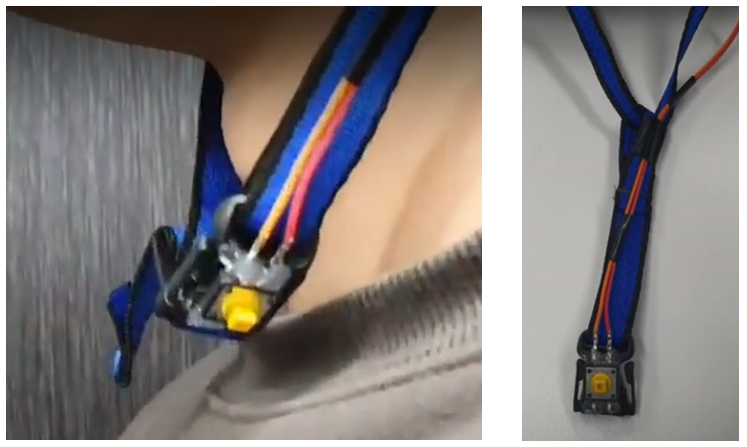
>
>
>
>The Button on the chin strap is for reversing the motor. The button is connected to PC_13 pin and it triggers 'EXTI15_10_IRQHandler '. When the interrupt is pending the  'motor_reverse' value changes to 1 and it makes the stepper motor to rotate 3000 steps counterclockwise.
>
>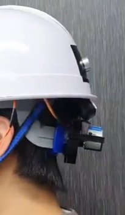
>
>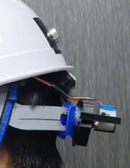
>
>
>------
>
>**Body temperature detection**
>
>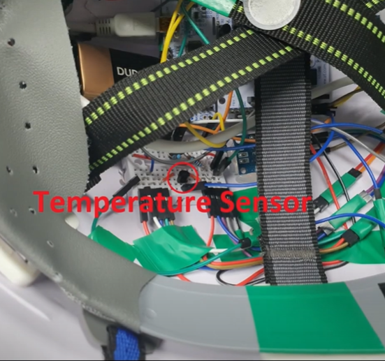
>
>
>
>1. Sensor  Activation
>   The temperature sensor is initialized. It uses the ADC (Analog-to-Digital Converter) to measure the body temperature. The sensor is connected to JADC_CH3 register.
>
>2. High Temperature Alert
>
>
>
>When the value exceeds the threshold(600) for high temperature, the system triggers an alert, red led on.
>
>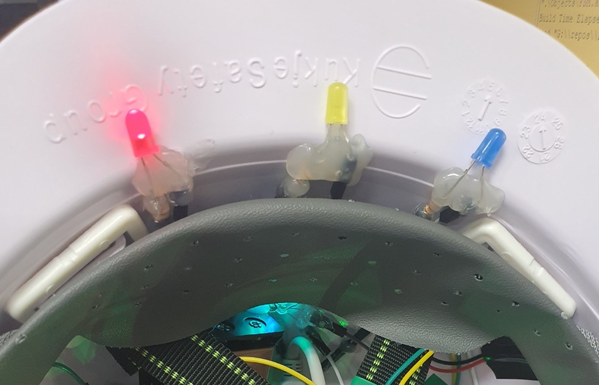
>
>3. Low Temperature Alert
>
>
>
>When the value is lower then threshold value(300) for low temperature, the system triggers an alert, blue led on.
>
>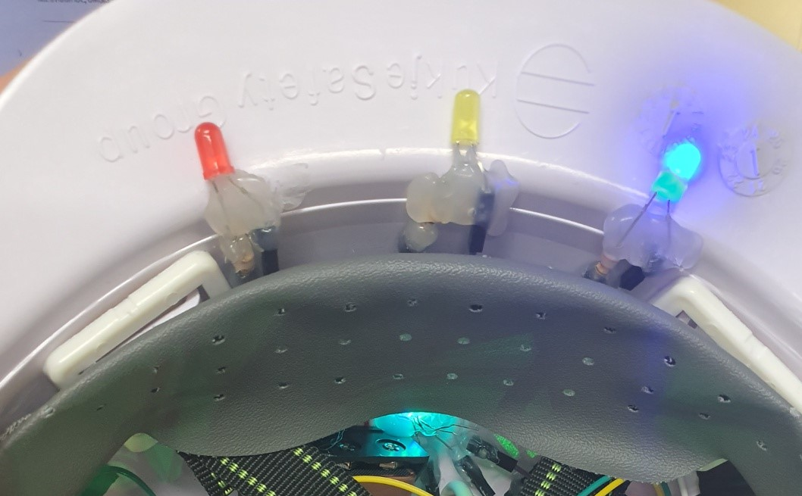
>
>
>------
>
>**Rear detection**
>
>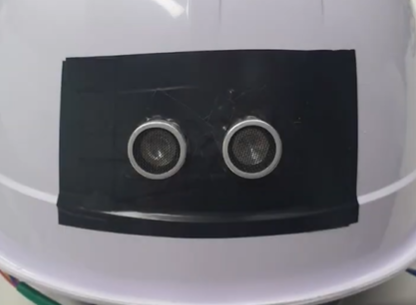
>
>1. Sensor Trigger
>
>Ultra sonic sensor is used to detect object on the back of the helmet by input timer capture, echo and trig.
>
>2. Rear Object Alert
>
>
>
>When object is detected with in 15 cm, yellow led turns on.
>
>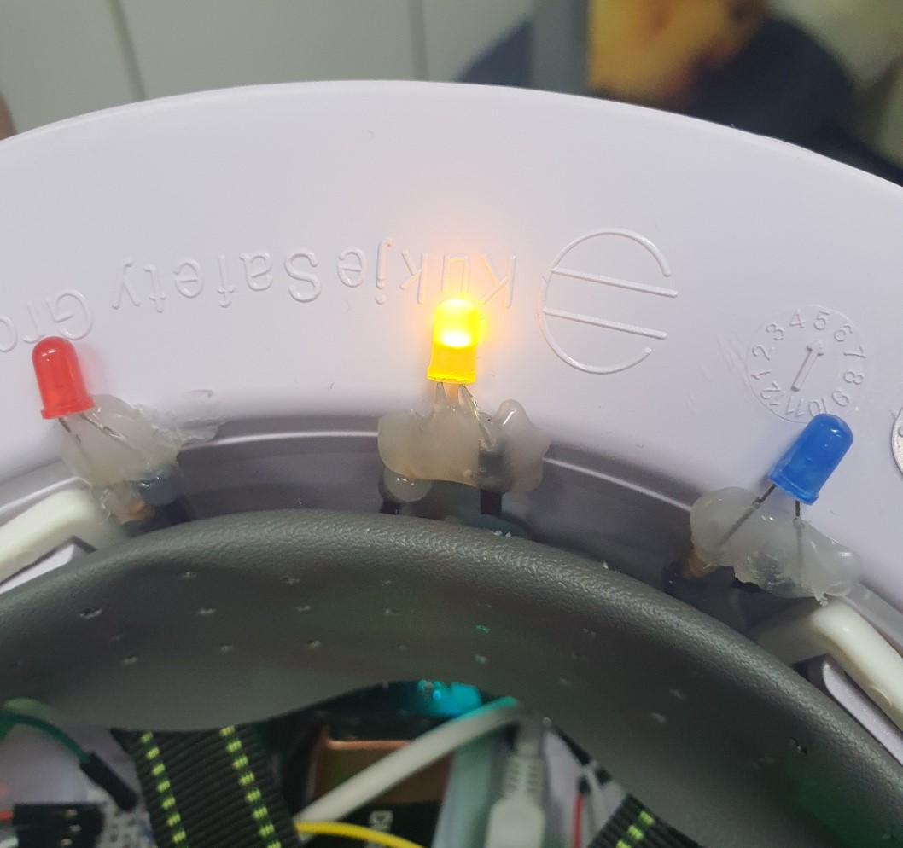
>
>​											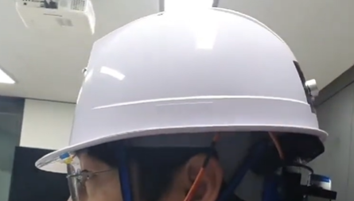
>
>------
>
>**Toxic gas detection**
>
>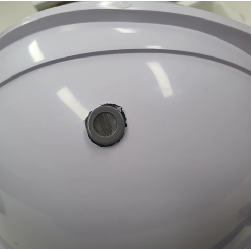
>
>1. Sensor Activation
>
>Gas sensors monitor the surrounding environment for harmful gases such as CO. and save the value at JADC_CH2 register.
>
>2. Alert Mechanism
>
>
>
>When the concentration exceeds a predefined threshold value (4000), the sensor triggers an alert by vibrating the motor.
>
>
>
>------
>
>**LED adaptive brightness**
>
>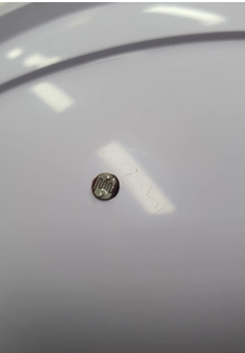
>
>1. Sensor Activation
>
>It uses the ADC (Analog-to-Digital Converter) to measure the surrounding light. The sensor is connected to JADC_CH1 register.
>
>2. LED Feedback
>
>   	
>
>Based on the light value, the headlight adjusts its brightness. If the light sensor value is lower than 800, the headlight is turned off. If the value exceeds 800, the brightness is adjusted based on the sensor input
>
>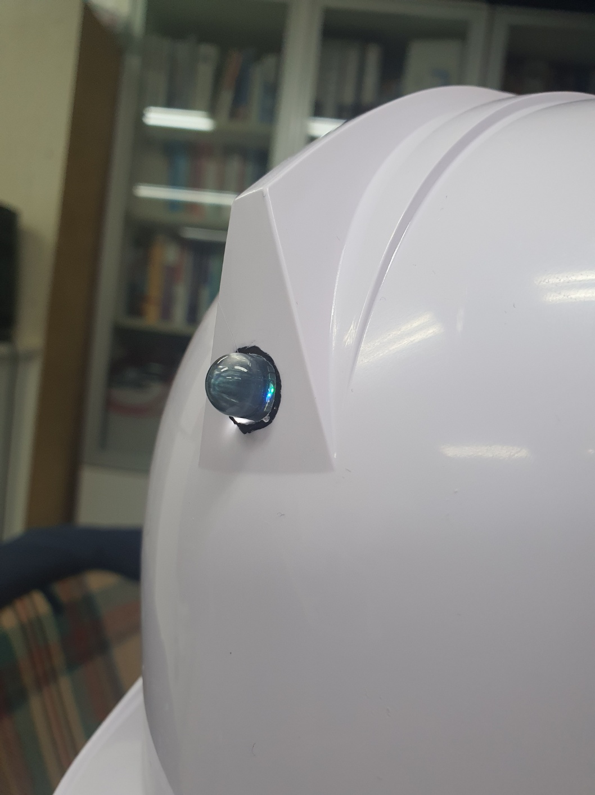
>
>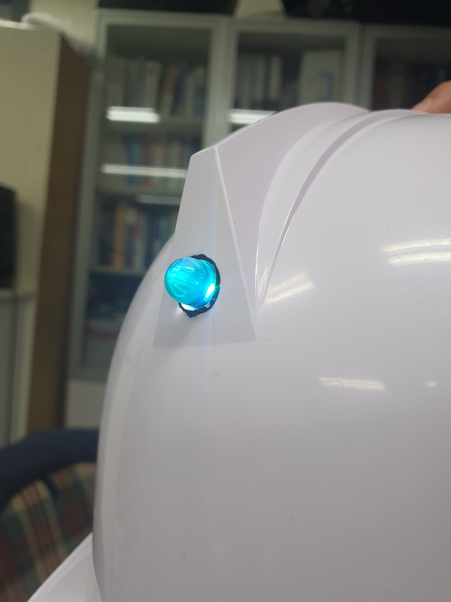
>
>------
>
>**Shock detection**
>
>
>
>1. Shock Detection Trigger
>
>The shock detection sensor provides a digital signal when the set shock threshold is detected. The shock threshold can be adjusted by controlling the resistance value. This digital signal is connected to EXTI3 interrupt.
>
>2. Shock Alert
>
>
>
>When a shock is detected, the EXTI3 interrupt is triggered, sending a '1' flag via Bluetooth. Upon receiving the '1' on the monitoring pad, it resets the accident-free days, activates the buzzer, and displays the "worker in danger" message.
>
>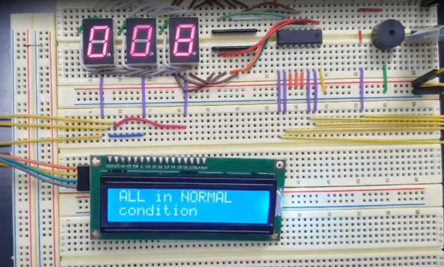
>
>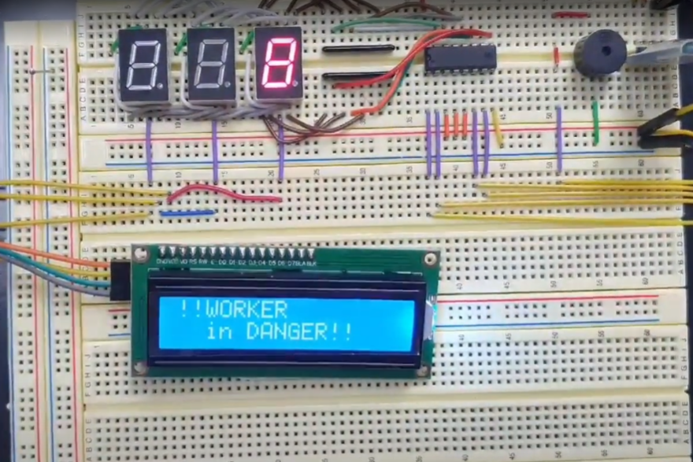
>
>------
>
>**Up count date**
>
>Using a timer interrupt set for one day, the cnt flag is raised, and the cnt value is displayed on the 7-segment display.
>
>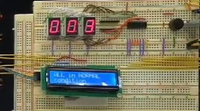
>
>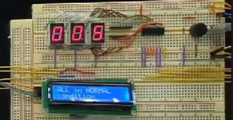


[demo video link](https://youtu.be/d4H0N-ZpbkU)

------

## V. Discussion

1. Why we chose stepper motor to auto size?

   **Precise Position Control**: Stepper motors allow for accurate and repeatable movements without requiring feedback systems.

   **High Torque at Low Speeds**: Ideal for applications needing incremental adjustments.

   **Ease of Integration**: Simple to interface with microcontrollers and control via software.

   **Reliability**: Operates smoothly in open-loop systems without complex mechanisms.

   

2. Is serial communication suitable for this project?

   Serial communication may not be suitable for this project. These alternatives provide better efficiency and scalability for one-to-many communication, offering specialized benefits over traditional serial communication depending on the specific use case of your project.

   **I2C (Inter-Integrated Circuit)**:

   - Suitable for communication between a master device and multiple slave devices over short distances.
   - Supports multiple devices on the same bus with minimal wiring, making it ideal for systems where many devices need to be connected and communicated with simultaneously.

   **SPI (Serial Peripheral Interface)**:

   - High-speed communication protocol ideal for connecting multiple devices in close proximity.
   - Supports multiple devices (using chip-select lines) and offers faster data transfer rates than traditional serial communication.

   **CAN (Controller Area Network)**:

   - Ideal for applications where many devices need to communicate reliably, especially in automotive or industrial environments.
   - Designed for use in noisy environments with multiple devices connected to a bus, making it highly efficient for one-to-many communication.

   **Bluetooth**:

   - Wireless communication suitable for mobile or remote applications where many devices need to be connected in a mesh or star topology.
   - Allows low-power consumption and easy integration with other wireless devices, supporting a range of up to several devices in a network.

   **Wi-Fi**:

   - Ideal for longer-distance, high-speed communication with many devices, especially when the devices are spread out over a large area.
   - Supports remote connectivity over internet networks, enabling real-time data transmission between multiple devices.

   **Zigbee**:

   - A low-power, wireless communication standard designed for short-range communication in a mesh network configuration.

   - Supports the connection of many devices within IoT and automation systems, where communication between a large number of devices is required.

     

3. How can a motor with insufficient torque be made to run?

   **Provide external power**: Increase the power supply to the motor to ensure it has enough torque to function.

   **Design a lower gear ratio**: Modify the mechanical system by using a gearbox with a lower gear ratio, which increases the output torque at the expense of speed.

   

4. How can multiple 7-segment displays be controlled with a single decoder?

   **Multiplexing** is the key technique for controlling multiple 7-segment displays with a single decoder. In multiplexing, you rapidly switch between different displays, lighting up one display at a time while keeping the others off. This happens so quickly that the human eye perceives all displays as simultaneously showing values.

   

5. Is it possible to detect a falling edge when the chinstrap comes off instead of using a button?

   It is possible to detect a falling edge when the chinstrap comes off without using a traditional button, by leveraging different sensing technologies.

    -**Pressure Sensors**

   - **How it works**: Place a pressure sensor on the chinstrap that detects the change in pressure when the chinstrap is removed.
   - **Falling edge detection**: When the chinstrap is in place, the pressure is stable. Upon removal, the pressure drops, and you can detect the falling edge (drop in pressure).
   - **Implementation**: This would require an analog-to-digital converter (ADC) to read the pressure value, and you could monitor the change to detect the falling edge.

    -**Hall Effect Sensor**

   - **How it works**: A Hall effect sensor can detect a magnetic field. Attach a small magnet to the chinstrap and place the sensor near it. When the chinstrap is in place, the magnetic field is detected. Upon removal of the chinstrap, the sensor will no longer detect the field.
   - **Falling edge detection**: The absence of the magnetic field can be detected as a falling edge, triggering a response in your system.

   -**Optical Sensors (Photodiodes or IR Sensors)**

   - **How it works**: An optical sensor can detect a break in the light path when the chinstrap comes off. You could position an emitter and receiver pair (IR LEDs and photodiodes, for example) to detect when the chinstrap is removed.
   - **Falling edge detection**: When the chinstrap is in place, the light path is uninterrupted. Removing the chinstrap will cause the light to be interrupted, which you can detect as a falling edge.

   -**Capacitive Touch Sensors**

   - **How it works**: Capacitive touch sensors detect changes in capacitance caused by the proximity of a human body or a material. A sensor could be placed in contact with the chinstrap or near it, and it could sense when the strap is removed.
   - **Falling edge detection**: A drop in capacitance (when the strap is removed) can be detected as a falling edge, and the system can trigger an action based on that.

   -**Resistive (Flex) Sensors**

   - **How it works**: These sensors change their resistance when bent or flexed. If you place such a sensor on the chinstrap, it can detect changes in tension when the chinstrap is being removed.
   - **Falling edge detection**: When the chinstrap is removed, the resistance will change, and this can be used to detect the falling edge.

   -**Proximity Sensors**

   - **How it works**: A proximity sensor, such as an inductive or capacitive type, can be used to detect the presence of the chinstrap. The sensor detects when the chinstrap is close enough to trigger a response.
   - **Falling edge detection**: The absence of the chinstrap (as it moves away) can be detected as a falling edge.

   

6. What additional features can be added for safety?

**Real-Time GPS Tracking**

   - **Feature**: Add a **GPS module** to the helmet to track the user's location in real time.
   - **Safety Function**: In case of an accident, the GPS data can help emergency responders locate the individual quickly.
   - **Remote Monitoring**: The helmet can send location updates to a monitoring system or an app for tracking purposes.

**Automatic Fall Detection**

   - **Feature**: Use a combination of **accelerometers** and **gyroscope sensors** to detect if the user falls or loses balance.
   - **Safety Function**: When a fall is detected, the helmet system can send a notification to an emergency contact or activate a safety protocol.
   - **Prevention**: Include sensors that can notify the user to adjust their posture or alert them to risky behavior based on tilt angles.

**Emergency Button**

   - **Feature**: Integrate an **emergency button** that can be pressed manually in case of danger.
   - **Safety Function**: Pressing the button could send an immediate alert to predefined emergency contacts, notify emergency services, and provide location tracking.
   - **Customizable Alerts**: Allow the user to customize the emergency alert message or trigger additional actions, such as activating lights or sirens.

------

## VI. Reference

1. Yifeng Zhu - Embedded Systems with ARM Cortex-M Microcontrollers in Assembly Language and C (2018)
2. [EC]https://ykkim.gitbook.io/ec/ec-course/lab/lab-input-capture-ultrasonic (Github)
3. [EC]  https://ykkim.gitbook.io/ec/ec-course/lab/lab-timer-and-pwm (Github)
4. [arduino push button] / https://docs.arduino.cc/built-in-examples/digital/Button/ (Blog)
5. [3-digit 7 segment]  gment-led-display/ https://osoyoo.com/2017/08/08/3-digit-7-se (Blog)

## Appendix

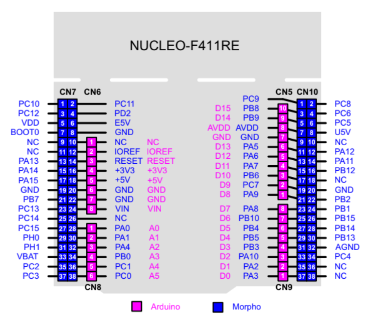

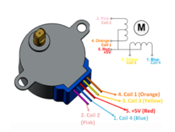

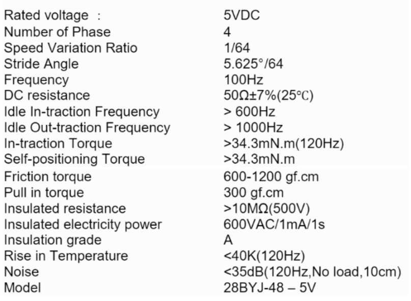

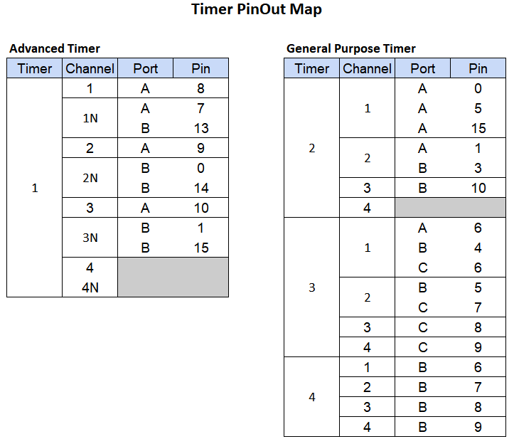

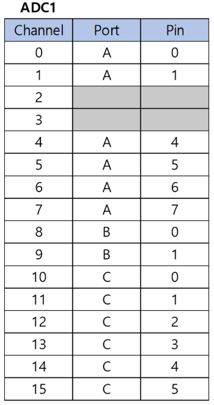

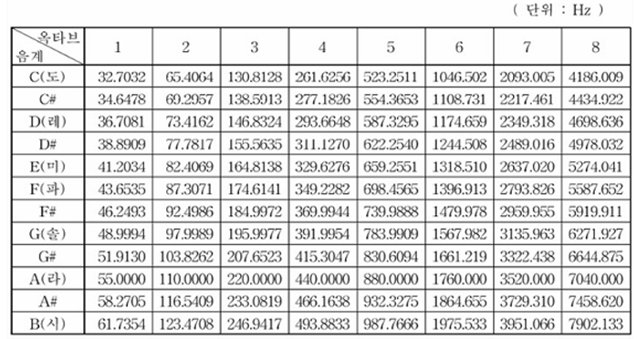

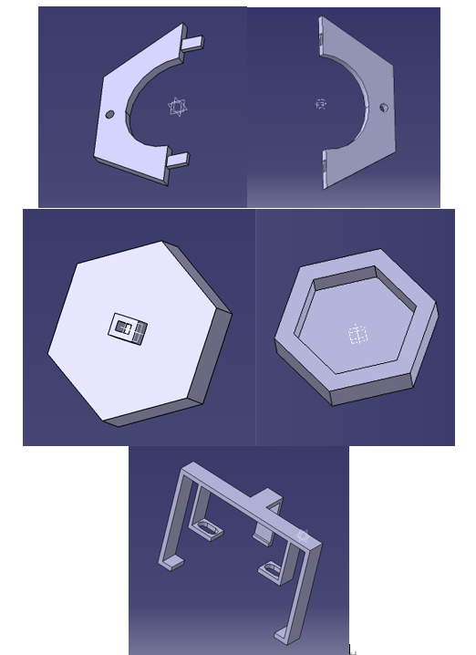

### Troubleshooting

1. CAN NOT control 'pin in' Arduino uno with STM32 'pin out'

   ​	sol) connect GND together. 

2. When the PWM duty cycle was set to 0, the LED still emitted a faint light.

   ​	sol) Increase the resistance value of the LED

3. When the function of the stepper motor is operating, ADC values cannot be read.

   ​	sol) Operate the stepper motor with shorter steps multiple times

4. JADC has only 4 channels, but we need to use at least 5 analog sensors. No register to store analog values.

   ​	sol) Use an ADC register additionally. OR Map the ADC register channels.
